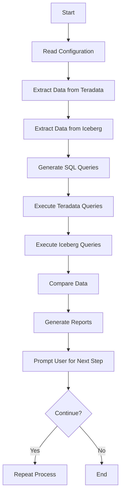

# Data_validation_automation

This is a complete end-to-end Python automated pipeline for Data Extraction, Transformation, and Validation. Built using Python for the ETL validation automation from Teradata to Snowflake project, where AWS is the staging area.

## Flowchart



## Components

1. **Data Extraction**: Extract data from Teradata and Iceberg using JDBC connections.
2. **Data Transformation**: Transform the data using custom SQL queries.
3. **Data Validation**: Validate the data by comparing results from Teradata and Iceberg.
4. **Reporting**: Generate reports based on the validation results.
5. **User Interaction**: Prompt the user to decide whether to continue or terminate the process.

## Files

- `Data_extraction_config.json`: Configuration file for database connections.
- `td_ddl_extract.py`: Script for extracting DDL from Teradata.
- `sql_genarator.py`: Script for generating SQL queries for validation.
- `PD_encryptor.py`: Script for decrypting passwords.
- `hash_dataframe.py`: Script for hashing dataframes.
- `td_vs_sf_validation.py`: Main script for executing the validation pipeline.

## Usage

1. **Update Configuration**: Update the `Data_extraction_config.json` with your database connection details.
2. **Run the Main Script**: Execute the `td_vs_sf_validation.py` script to start the validation pipeline.
3. **Extract DDL**: The script will extract DDL from Teradata and Iceberg.
4. **Generate SQL Queries**: SQL queries for validation will be generated.
5. **Execute Queries**: The script will execute the generated queries on Teradata and Iceberg.
6. **Compare Data**: The results from Teradata and Iceberg will be compared.
7. **Generate Reports**: Reports based on the comparison will be generated.
8. **User Interaction**: The user will be prompted to decide whether to continue or terminate the process.

## Example

To run the validation pipeline, use the following command:

```sh
python td_vs_sf_validation.py
```

Make sure to update the `Data_extraction_config.json` file with your database connection details before running the script.
